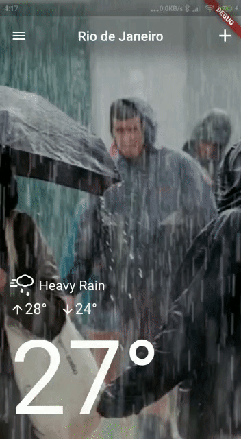

# FLUTTER WEATHER APP

# PATTERNS
* [BLOC](https://www.didierboelens.com/2018/08/reactive-programming---streams---bloc/)

# DEPENDENCIES

* [flutter_bloc](https://pub.dev/packages/flutter_bloc)
* [permission_handler](https://pub.dev/packages/permission_handler)
* [hive](https://pub.dev/packages/hive)
* [hive_flutter](https://pub.dev/packages/hive_flutter)
* [geolocator](https://pub.dev/packages/geolocator)
* [intl](https://pub.dev/packages/intl)

